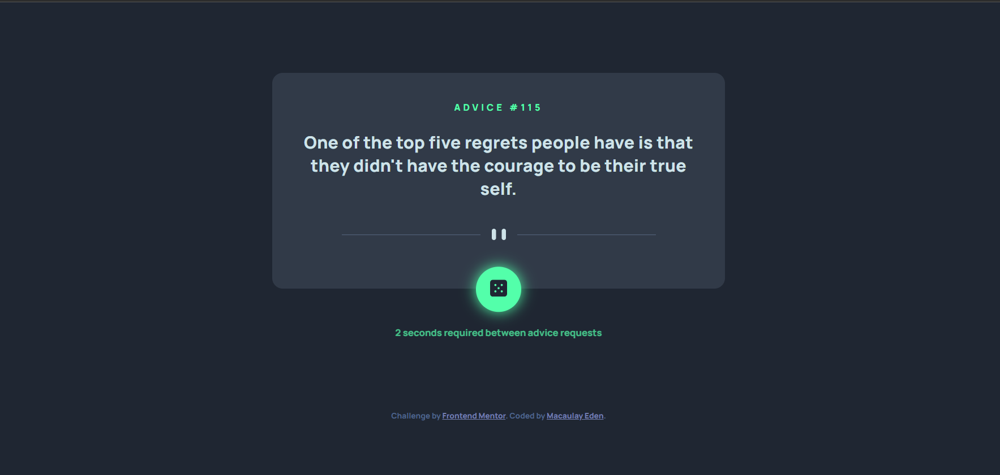

# Frontend Mentor - Advice generator app solution

This is a solution to the [Advice generator app challenge on Frontend Mentor](https://www.frontendmentor.io/challenges/advice-generator-app-QdUG-13db). Frontend Mentor challenges help you improve your coding skills by building realistic projects.

## Table of contents

- [Overview](#overview)
  - [The challenge](#the-challenge)
  - [Screenshot](#screenshot)
  - [Links](#links)
- [My process](#my-process)
  - [Built with](#built-with)
  - [What I learned](#what-i-learned)
  - [Continued development](#continued-development)

## Overview

### The challenge

Users should be able to:

- Generate a piece of advice using a button

### Screenshot




### Links

- Solution URL: [Add solution URL here](https://your-solution-url.com)
- Live Site URL: [Add live site URL here](https://your-live-site-url.com)

## My process

### Built with

- Semantic HTML5 markup
- CSS custom properties
- Vanilla Javascript
- Mobile-first workflow

### What I learned

The major reason for using this was to learn how to create requests to APIs, I completed this in 3 ways, the first and one in use is via Async/Await fetch API, the second being fetch without Async/Await and finally, using XMLHttpRequest(). 

```js

async function generateAdvice() {
    // Fetch request using Async/Await 
    const response = await fetch('https://api.adviceslip.com/advice');
    const adviceJson = await response.json();
    const adviceId = adviceJson.slip.id;
    const adviceText = adviceJson.slip.advice;

    adviceIdContainer.textContent = adviceId;
    adviceTextContainer.textContent = adviceText;


    // Fetch method for practice. 
    
    // fetch('https://api.adviceslip.com/advice')
    //     .then(response => {
    //         if (!response.ok) {   //Check for network error, which does not set off .catch
    //             throw new Error("Network error occured")
    //         }
    //         return response.json()
    //     })
    //     .then(data => {
    //         adviceIdContainer.textContent = data.slip.id;
    //         adviceTextContainer.textContent = data.slip.advice;           
    //     })
    //     .catch(error => {
    //         console.log(error)
    //     })


    //Below is the XMLHttpRequest, which is added for practice and will work with 
    //IE, but also requires the onclick function to have the async removed and
    //the script tag to be moved to the head to work with IE, but due to it's end
    //of life in June, have not opted to spent large amounts of time on conditionals
    //for it to work completely. 

    //XMLHttpRequest method for IE
    // let xhr = new XMLHttpRequest();
    // xhr.open('GET', 'https://api.adviceslip.com/advice', true);
    // xhr.responseType = 'json';
    // xhr.onload = function() {
        //adviceIdContainer.textContent = data.slip.id;
        //adviceTextContainer.textContent = data.slip.advice;     
    // }
    // xhr.send();

}
```

### Continued development

I want to continue applying Javascript to websites to improve functionality. 

## Author

- Website - [Macaulay Eden - Github](https://github.com/EdenExperiments)
- Frontend Mentor - [@yourusername](https://www.frontendmentor.io/profile/EdenExperiments)
